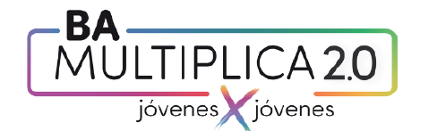
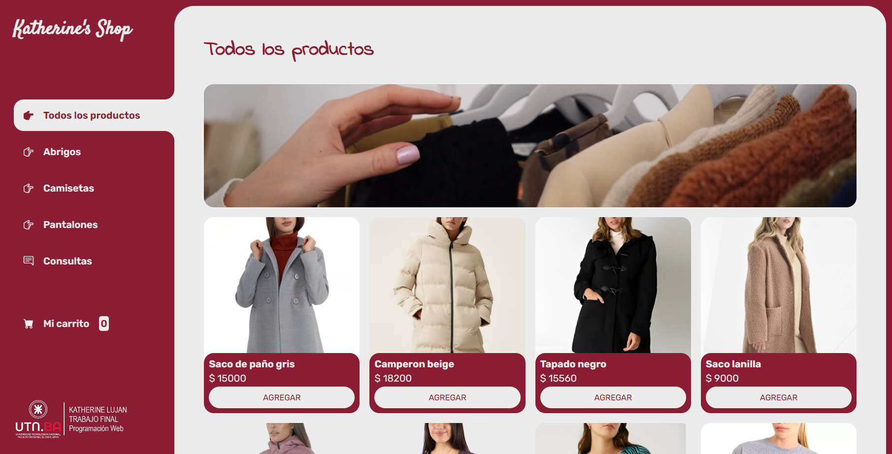
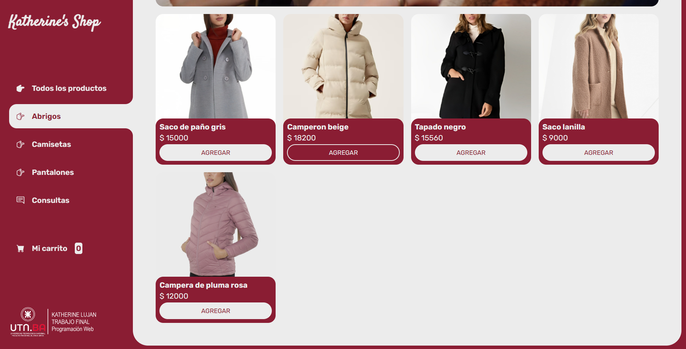
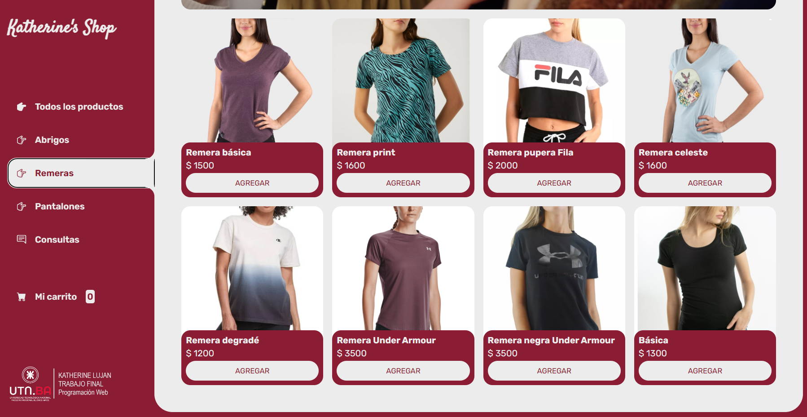
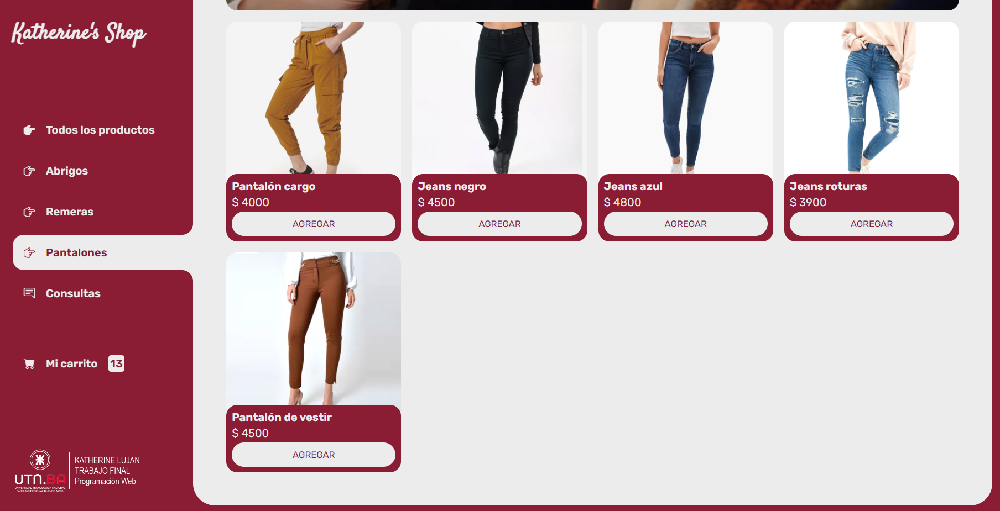
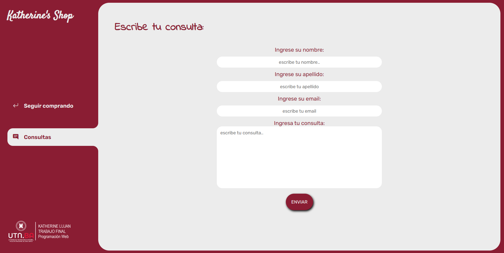
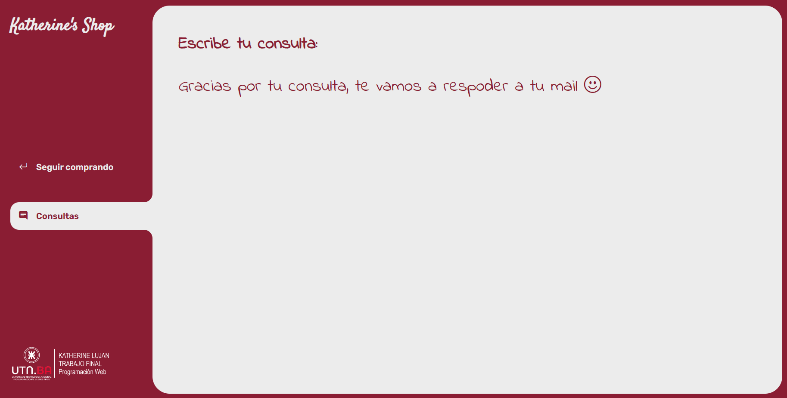
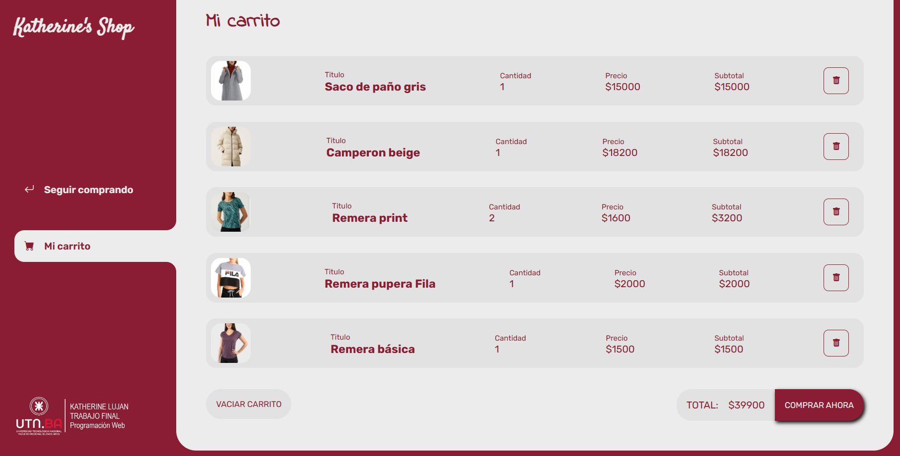
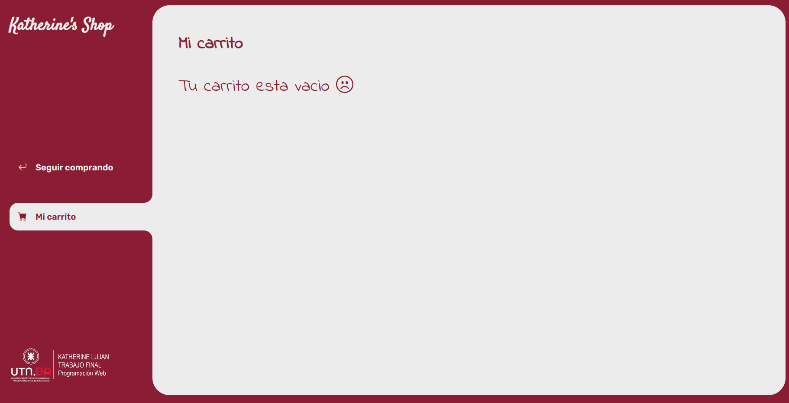
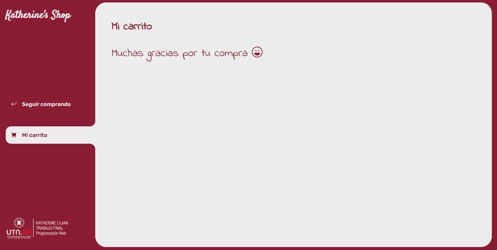

# **Universidad Tecnologica Nacional**
-----
Programacion Web Inicial BA MULTIPLICA 2023 C56
# **UTN-FRA**

# PROYECTO FINAL 
**Estudiante:** Katherine Lujan Quiroz 
**Curso:** 56 

KATHERINE'S SHOP  
Mi tienda virtual 

Este es mi proyecto final para el curso de Programación Inicial. Se trata de una tienda virtual de ropa de mujeres, donde los usuarios pueden explorar y comprar productos de moda de manera fácil y conveniente.

**CARACTERISTICAS PRINCIPALES**

* Catálogo de productos: El sitio cuenta con un amplio catálogo de ropa de mujeres, incluyendo vestidos, blusas, pantalones, accesorios y más. Los usuarios pueden navegar por las diferentes categorías y ver detalles de los productos.
* Funcionalidad de carrito de compras: Los usuarios pueden agregar productos a su carrito de compras, ver un resumen de los productos seleccionados, y proceder al proceso de pago.

**TECNOLOGIAS UTILIZADAS**
* HTML5
* CSS3
* Bootstrap
* JavaScript

# Interface

